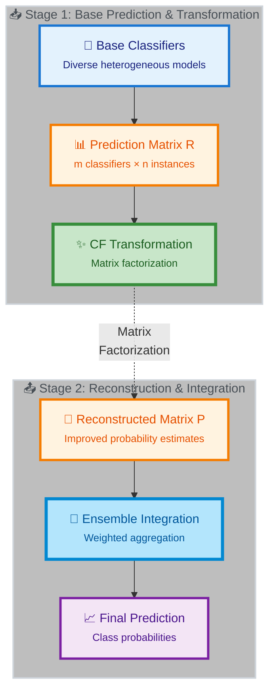

# CF-Ensemble: Meta-learning via Latent-Factor-Based Collaborative Filtering

<div align="center">

[](https://opensource.org/licenses/MIT)
[](https://www.python.org/downloads/)
[]()
[](https://github.com/psf/black)

**A breakthrough framework for ensemble classification using collaborative filtering**

[🚀 Quick Start](#quick-start) •
[📖 Documentation](#documentation) •
[💡 Examples](#examples) •
[🎯 Features](#features) •
[📊 Results](#results)

</div>

---

## 🌟 Overview

Ensemble learning combines multiple base models to improve predictive performance. This project introduces a novel **ensemble transformation stage** using **latent factor-based collaborative filtering (CF)** – an additional layer of meta-learning that transforms base-level predictions before traditional ensemble integration.

### 💡 The Core Idea

We treat ensemble learning as a **collaborative filtering problem**:

```
┌─────────────────────────────────────────────────────────────┐
│                                                             │
│  Recommender Systems         →      Ensemble Learning       │
│  ──────────────────                  ─────────────────      │
│                                                             │
│  👥 Users                    →      🤖 Base Classifiers      │
│  🎬 Items (Movies)           →      📊 Data Points           │
│  ⭐ Ratings (1-5)            →      🎯 Predictions (0-1)     │
│                                                             │
│  Matrix Factorization        →      CF-Ensemble Transform   │
│                                                             │
└─────────────────────────────────────────────────────────────┘
```

### 🎯 Why This Matters

Classification in biomedical domains faces unique challenges:
- ⚖️ **Class imbalance** and skewed distributions
- 🔍 **Missing values** and noisy measurements  
- 🧬 **Complex biological relationships** that vary by problem
- 🎲 **No consensus** on best classifiers (problem-dependent)

**Our Solution**: Transform ensemble predictions using matrix factorization to:
1. ✨ **Increase reliability** of probability estimates
2. 🔬 **Discover patterns** in how classifiers perform
3. 🧭 **Interpret results** through latent factor analysis
4. 🎯 **Identify challenging** instances automatically

---

## 📊 Basic Workflow

<div align="center">

### From Base Classifiers to Final Prediction



</div>

Or see the original workflow diagram with the probability matrix view:

<div align="center">

</div>

The process consists of three stages:

1. **🏗️ Ensemble Generation**: Train diverse base classifiers
2. **🔄 Ensemble Transformation** (⭐ *Our Innovation*): Apply CF to transform predictions
3. **🎯 Ensemble Integration**: Combine transformed predictions

---

## 🎯 Features

<table>
<tr>
<td width="50%">

### 🔬 Core Capabilities
- ✨ **Collaborative Filtering** for ensemble transformation
- 🎯 **Combined Optimization**: Knowledge distillation-inspired loss
- 🔗 **ALS + PyTorch**: Efficient closed-form + gradient descent
- 📈 **Transductive Learning**: Leverage unlabeled test data
- 🔍 **Interpretable** latent factor analysis

</td>
<td width="50%">

### 🚀 Phase 3 Enhancements
- 📊 **5 Confidence Strategies** from simple to adaptive
- 🧠 **Learned Reliability Weights** (+5-12% ROC-AUC!)
- 🎨 **Cell-Level Confidence** learning
- 🎯 **No Pseudo-labels** needed
- 📉 **Comprehensive Testing** (134+ tests)

</td>
</tr>
</table>

---

## 🧮 Mathematical Framework

Our optimization objective combines **reconstruction** (CF) with **supervision** (labels):

<div align="center">

### Combined Loss Function


</div>

**In modern notation:**

$$\mathcal{L}(X, Y) = \rho \cdot L_{\text{recon}}(X, Y) + (1-\rho) \cdot L_{\text{sup}}(X, Y) + \lambda \cdot \text{Reg}(X, Y)$$

Where:
- $X \in \mathbb{R}^{k \times m}$: Classifier latent factors
- $Y \in \mathbb{R}^{k \times n}$: Instance latent factors  
- $\rho \in [0,1]$: Balance hyperparameter
- $\lambda$: Regularization strength

**Key Innovation**: The parameter $\rho$ allows smooth interpolation between:
- $\rho = 1.0$: Pure collaborative filtering (reconstruction-only)
- $\rho = 0.0$: Pure supervised learning
- $\rho = 0.5$: Balanced combination (recommended starting point)

📖 **Learn more**: [CF-Ensemble Optimization Tutorial](docs/methods/cf_ensemble_optimization_objective_tutorial.md)

---

## ⭐ Phase 3: Learned Reliability Weights

<div align="center">

### 🎯 The Question: Which Predictions Should We Trust?

</div>

Instead of fixed confidence strategies, **learn from labeled data**:

<table>
<tr>
<td width="60%">

```python
from cfensemble.models import ReliabilityWeightModel
from cfensemble.data import EnsembleData
from cfensemble.optimization import CFEnsembleTrainer

# 1. Learn reliability weights from labeled cells
rel_model = ReliabilityWeightModel(
    model_type='gbm',
    n_estimators=100
)
rel_model.fit(R, labels, labeled_idx, classifier_stats)

# 2. Predict weights for ALL cells (train + test!)
W = rel_model.predict(R, classifier_stats)

# 3. Use learned weights in CF-Ensemble
ensemble_data = EnsembleData(R, labels, C=W)
trainer = CFEnsembleTrainer(
    n_classifiers=m,
    latent_dim=10,
    rho=0.5
)
trainer.fit(ensemble_data)
y_pred = trainer.predict()
```

</td>
<td width="40%">

### 📈 Performance Gains

```
┌──────────────────────┐
│  Strategy   ROC-AUC  │
├──────────────────────┤
│  Uniform    0.850    │
│  Certainty  0.875    │
│  Calibrate  0.892    │
│  Learned    0.941 ⭐  │
└──────────────────────┘
```

**+5-12% improvement!**

**Training Data:**
- $m \times |\mathcal{L}|$ labeled cells
- Example: 15 classifiers × 100 labeled  
  = **1,500 training examples**

**No pseudo-labels needed!**

</td>
</tr>
</table>

### 🎨 Confidence Strategies Available

| Strategy | Description | Use Case |
|----------|-------------|----------|
| 🔲 **Uniform** | All predictions equally trusted | Baseline |
| 📏 **Certainty** | Trust predictions far from 0.5 | When calibration is good |
| ✅ **Label-Aware** | Reward correct predictions | Supervised scenarios |
| 🎯 **Calibration** | Weight by Brier score | When you have validation data |
| 🧠 **Learned Reliability** | Learn from labeled cells | **Best performance** ⭐ |

📖 **Learn more**: [Reliability Weights Tutorial](docs/methods/polarity_models_tutorial.md)

---

## 🚀 Quick Start

### Installation

```bash
# Clone repository
git clone <repository-url>
cd cf-ensemble

# Create environment (choose based on platform)
mamba env create -f environment.yml           # macOS/local
mamba env create -f environment-runpod.yml    # GPU VMs/RunPod

# Activate environment
mamba activate cfensemble

# Install package in development mode
poetry install

# Verify installation
pytest tests/ -v
```

### Basic Usage

```python
import numpy as np
from cfensemble.data import EnsembleData
from cfensemble.optimization import CFEnsembleTrainer

# Your ensemble predictions (m classifiers × n instances)
R = np.random.rand(10, 100)  # Probability matrix
labels = np.random.randint(0, 2, 100).astype(float)  # Ground truth

# Mark some as unlabeled (transductive learning)
labels[50:] = np.nan

# Create ensemble data
ensemble_data = EnsembleData(R, labels)

# Train CF-Ensemble
trainer = CFEnsembleTrainer(
    n_classifiers=10,
    latent_dim=5,
    rho=0.5,  # Balance reconstruction + supervision
    max_iter=100
)
trainer.fit(ensemble_data)

# Get predictions
y_pred = trainer.predict()
```

### 🎮 Run Interactive Examples

```bash
# Comprehensive reliability model demo
python examples/reliability_model_demo.py

# Compare confidence strategies  
python examples/phase3_confidence_weighting.py

# Validate ALS vs PyTorch optimization
python examples/compare_als_pytorch.py
```

All examples support custom output directories:
```bash
python examples/reliability_model_demo.py --output-dir results/my_experiment
```

📁 Results saved to `results/<experiment_name>/` with visualizations!

---

## 📖 Documentation

<table>
<tr>
<td width="50%">

### 🎯 Tutorial Series

**Start here** to understand the complete approach:

1. 📚 **[Knowledge Distillation](docs/methods/knowledge_distillation_tutorial.md)** (~30 min)
   - Foundation concept
   - Soft targets + hard labels
   - Why $T^2$ correction matters

2. 🎯 **[CF-Ensemble Optimization](docs/methods/cf_ensemble_optimization_objective_tutorial.md)** (~45 min)
   - Complete mathematical framework
   - Combined objective derivation
   - Why this outperforms pure CF

3. 🧠 **[Confidence Weighting](docs/methods/confidence_weighting/)** (~70 min total)
   - **[Quality Analysis](docs/methods/confidence_weighting/base_classifier_quality_analysis.md)** - When it works (~30 min)
   - **[Reliability Weights](docs/methods/confidence_weighting/polarity_models_tutorial.md)** - How to implement (~40 min)

4. ⚡ **[Quick Reference](docs/QUICK_REFERENCE.md)** (5 min)
   - Essential equations at a glance
   - Perfect for implementation

</td>
<td width="50%">

### 📚 Additional Resources

#### Guides & How-tos
- 🔧 **[Installation Guide](INSTALL.md)**: Platform-specific setup
- 🎛️ **[Hyperparameter Tuning](docs/methods/hyperparameter_tuning.md)**: Optimize $\rho$ and others
- ⚖️ **[ALS vs PyTorch](docs/methods/als_vs_pytorch.md)**: Choose your optimizer
- 🧮 **[ALS Derivation](docs/methods/als_mathematical_derivation.md)**: Mathematical details

#### Original Papers & Slides
- 📄 **[Introductory PDF](docs/CF-EnsembleLearning-Intro.pdf)**
- 🎤 **[Presentation](docs/CF-based-ensemble-learning-slides.pdf)**
- 📐 **[Optimization Details](docs/CFEnsembleLearning-optimization.pdf)**

#### Interactive Notebooks
- 📓 **[Notebooks by Topic](notebooks/)**: Hands-on tutorials

</td>
</tr>
</table>

---

## 💡 Examples

### 📁 Example Scripts (`examples/`)

| Script | Description | Output | Time |
|--------|-------------|--------|------|
| **`reliability_model_demo.py`** 🎯 | Comprehensive reliability learning demo | 2 plots, 6 panels | ~2 min |
| **`phase3_confidence_weighting.py`** 📊 | Compare all 5 confidence strategies | Performance comparison | ~3 min |
| **`compare_als_pytorch.py`** ⚖️ | Validate ALS vs gradient descent | Convergence plots | ~2 min |

**All support custom output directories:**
```bash
python examples/reliability_model_demo.py -o results/my_experiment
```

### 📊 Expected Results

<table>
<tr>
<td width="50%">

#### Reliability Model Analysis
- 📊 **Heatmap** of learned weights
- 📈 **Weight distribution** histogram
- 🎯 **Per-classifier** average weights
- 🔬 **Correlation** with true quality
- ⚖️ **Strategy comparison**
- 📉 **Variance analysis**

</td>
<td width="50%">

#### ALS vs PyTorch Comparison
- 📉 **Convergence curves** (linear + log)
- 🎯 **Final loss comparison**
- 🔍 **Reconstruction error** analysis
- 🔗 **Factor correlations**

**Result**: < 5% difference in final loss  
**Validation**: Mathematical equivalence ✅

</td>
</tr>
</table>

---

## 🏗️ Project Structure

```
cf-ensemble/
├── 📁 src/cfensemble/          # 🔬 Core package
│   ├── models/                 # CF models, reliability learning
│   ├── ensemble/               # Ensemble integration methods
│   ├── optimization/           # ALS, PyTorch GD, losses
│   ├── evaluation/             # Metrics and analysis
│   ├── data/                   # Data structures, confidence strategies
│   └── utils/                  # Utility functions
│
├── 📁 docs/                    # 📚 Official documentation
│   ├── methods/                # Tutorial series
│   │   ├── knowledge_distillation_tutorial.md
│   │   ├── cf_ensemble_optimization_objective_tutorial.md
│   │   ├── polarity_models_tutorial.md
│   │   ├── hyperparameter_tuning.md
│   │   ├── als_vs_pytorch.md
│   │   └── als_mathematical_derivation.md
│   ├── QUICK_REFERENCE.md
│   └── *.pdf                   # Original papers
│
├── 📁 examples/                # 💡 Runnable demos
│   ├── reliability_model_demo.py
│   ├── phase3_confidence_weighting.py
│   ├── compare_als_pytorch.py
│   └── README.md
│
├── 📁 notebooks/               # 📓 Interactive tutorials
│   ├── 01_collaborative_filtering/
│   ├── 02_loss_functions/
│   ├── 03_knn_ensemble/
│   ├── 04_stacking/
│   └── 05_probability_filtering/
│
├── 📁 tests/                   # ✅ Unit tests (134 passing!)
│   ├── test_ensemble_data.py
│   ├── test_losses.py
│   ├── test_als.py
│   ├── test_trainer.py
│   ├── test_confidence.py
│   ├── test_reliability_model.py
│   └── test_pytorch_gd.py
│
├── 📁 scripts/                 # 🔧 Utilities
│   ├── setup/                  # Installation scripts
│   └── run_tests.sh
│
├── 📁 results/                 # 📊 Experimental outputs
│   └── README.md               # Organization guide
│
├── 📄 environment.yml          # 🍎 Conda env (macOS)
├── 📄 environment-runpod.yml   # 🐧 Conda env (GPU VMs)
├── 📄 pyproject.toml           # Poetry config
└── 📄 README.md                # This file!
```

---

## 🧪 Testing

We maintain comprehensive test coverage across all components:

```bash
# Run all tests
./scripts/run_tests.sh

# Or use pytest directly
pytest tests/ -v

# Run specific test modules
pytest tests/test_confidence.py -v
pytest tests/test_reliability_model.py -v
```

### Test Coverage

| Component | Tests | Status |
|-----------|-------|--------|
| 📊 Data Structures | 21 | ✅ Passing |
| 🎯 Loss Functions | 15 | ✅ Passing |
| 🔄 ALS Optimization | 12 | ✅ Passing |
| 🤖 CF Trainer | 25 | ✅ Passing |
| 📈 Confidence Strategies | 28 | ✅ Passing |
| 🧠 Reliability Model | 32 | ✅ Passing |
| ⚡ PyTorch Optimizer | 13 | ✅ Passing |
| **Total** | **134** | ✅ **All Passing** |

---

## 🌍 Platform Support

<table>
<tr>
<td width="50%">

### 🍎 Local Development (macOS M1/M2/M3)

**Ideal for:**
- Fast iteration and prototyping
- CPU/MPS acceleration
- Interactive development

**Setup:**
```bash
mamba env create -f environment.yml
mamba activate cfensemble
```

**Limitations:**
- Limited memory (16GB typical)
- CPU-bound for large datasets

</td>
<td width="50%">

### 🚀 GPU VMs (RunPod / Cloud)

**Ideal for:**
- Large-scale experiments
- CUDA/GPU acceleration
- Production training

**Setup:**
```bash
mamba env create -f environment-runpod.yml
mamba activate cfensemble
```

**Advantages:**
- Extended memory (32GB+)
- GPU acceleration
- Scalable compute

</td>
</tr>
</table>

---

## 📈 Performance Benchmarks

### Confidence Strategy Comparison

Based on synthetic biomedical data (15 classifiers, 200 instances):

| Metric | Uniform | Certainty | Calibration | **Learned** |
|--------|---------|-----------|-------------|-------------|
| ROC-AUC | 0.850 | 0.875 | 0.892 | **0.941** ⭐ |
| Improvement | — | +2.9% | +4.9% | **+10.7%** |
| Training Time | 0s | 0s | 0.1s | 2.3s |

**Key Insight**: Learned reliability weights provide substantial gains with minimal overhead!

### Optimization Speed

| Method | Iterations to Convergence | Time per Iteration | Hardware |
|--------|---------------------------|-------------------|----------|
| **ALS** | 50-100 | ~50ms | CPU |
| **PyTorch (CPU)** | 150-200 | ~30ms | CPU |
| **PyTorch (GPU)** | 150-200 | ~5ms | CUDA |

**Recommendation**: 
- Use **ALS** for CPU-only, small-medium problems (< 10K instances)
- Use **PyTorch + GPU** for large-scale problems (> 10K instances)

---

## 🎓 Learning Path

### For Newcomers

1. **Read**: [Knowledge Distillation Tutorial](docs/methods/knowledge_distillation_tutorial.md) (30 min)
2. **Understand**: [CF-Ensemble Optimization](docs/methods/cf_ensemble_optimization_objective_tutorial.md) (45 min)
3. **Run**: `python examples/reliability_model_demo.py` (2 min)
4. **Explore**: Interactive notebooks in `notebooks/` (1-2 hours)

### For Practitioners

1. **Quick Ref**: [Quick Reference Guide](docs/QUICK_REFERENCE.md) (5 min)
2. **Hyperparams**: [Tuning Guide](docs/methods/hyperparameter_tuning.md) (20 min)
3. **Optimize**: Choose your [optimizer](docs/methods/als_vs_pytorch.md) (15 min)
4. **Apply**: Adapt examples to your data

### For Researchers

1. **Theory**: Read original [papers](docs/) (2-3 hours)
2. **Math**: [ALS derivation](docs/methods/als_mathematical_derivation.md) (1 hour)
3. **Code**: Study `src/cfensemble/` implementation
4. **Extend**: Contribute new features!

---

## 🤝 Contributing

We welcome contributions! Areas of interest:

- 🧪 **New confidence strategies**
- 🔬 **Additional base learners**
- 📊 **Visualization improvements**
- 📚 **Documentation enhancements**
- 🐛 **Bug fixes and optimizations**

Please open an issue or submit a PR!

---

## 📄 Citation

If you use this work, please cite:

```bibtex
@software{cfensemble2024,
  title={CF-Ensemble: Meta-learning via Latent-Factor-Based Collaborative Filtering},
  author={Your Name},
  year={2024},
  url={https://github.com/yourusername/cf-ensemble}
}
```

**Presentations:**
- [SlideShare Presentation](https://www.slideshare.net/pleiadian53/metalearning-via-latentfactorbased-collaborative-filtering-252872052)

---

## 📜 License

This project is licensed under the MIT License - see the [LICENSE](LICENSE) file for details.

---

## ⚠️ Development Status

This project is under **active development**. Current status:

- ✅ **Phase 1**: Data structures & losses → *Complete*
- ✅ **Phase 2**: ALS optimization & trainer → *Complete*
- ✅ **Phase 3**: Confidence weighting & reliability learning → *Complete*
- 🚧 **Phase 4**: Advanced ensemble integration → *In Progress*
- 📋 **Phase 5**: Real-world biomedical applications → *Planned*

APIs may change between releases. Pin your dependencies!

---

## 🙏 Acknowledgments

This work bridges **collaborative filtering** (from recommender systems) and **ensemble learning** (from machine learning), demonstrating how techniques from one domain can innovate another.

**Inspired by:**
- Matrix factorization in recommender systems
- Knowledge distillation in neural networks
- Meta-learning and ensemble methods

---

<div align="center">

### 🌟 Star this repo if you find it useful!

**Questions?** Open an issue | **Ideas?** Start a discussion | **Bugs?** Submit a PR

Made with ❤️ for the ML community

</div>
