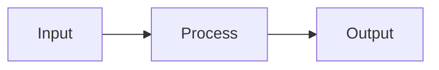

# CF-Ensemble Documentation Guide

This document explains how to build, view, and deploy the CF-Ensemble documentation with **MathJax support for LaTeX math rendering**.

---

## 📋 Table of Contents

1. [Overview](#overview)
2. [Local Development](#local-development)
3. [Writing Documentation](#writing-documentation)
4. [Deployment](#deployment)
5. [Troubleshooting](#troubleshooting)

---

## 🌟 Overview

Our documentation uses **MkDocs** with **Material theme** and **MathJax** for beautiful, professional documentation with LaTeX math rendering.

### Features

✅ **LaTeX math rendering** - Write equations like `$E = mc^2$` or `$$\int_0^\infty e^{-x} dx = 1$$`  
✅ **Material theme** - Professional, dark mode, mobile-friendly  
✅ **Auto-deployment** - Push to `main` → site updates automatically  
✅ **Search** - Full-text search across all docs  
✅ **Jupyter notebooks** - Render `.ipynb` files directly  
✅ **Mermaid diagrams** - Support for flowcharts and diagrams  

---

## 🛠️ Local Development

### Prerequisites

```bash
# Activate environment
mamba activate cfensemble

# Install documentation dependencies
pip install -r requirements-docs.txt
```

### Build and Serve Locally

```bash
# Serve with live reload (recommended for writing)
mkdocs serve

# Open browser to http://127.0.0.1:8000/
```

**Live reload:** Any changes to `.md` files will automatically refresh in browser!

### Build Static Site

```bash
# Build to site/ directory
mkdocs build

# Preview built site
cd site && python -m http.server 8000
```

---

## ✍️ Writing Documentation

### File Organization

```
docs/
├── index.md                    # Landing page
├── javascripts/
│   └── mathjax.js             # MathJax configuration
├── stylesheets/
│   └── extra.css              # Custom styling
├── methods/                    # Method documentation
│   ├── imbalanced_data_tutorial.md
│   ├── confidence_weighting/
│   └── ...
└── notebooks/                  # Jupyter notebooks (auto-rendered)
```

### Math Rendering

#### Inline Math

Use `$...$` for inline math:

```markdown
The quality metric $q$ should be PR-AUC when minority class rate is below 20%.
```

Renders as: The quality metric $q$ should be PR-AUC when minority class rate is below 20%.

#### Display Math

Use `$$...$$` for display equations:

```markdown
$$
\mathcal{L}(X, Y) = \rho \cdot \|R - XY^T\|_F^2 + (1-\rho) \cdot \sum_{(u,i) \in L} (r_{ui} - \text{label}_i)^2
$$
```

Renders as:

$$
\mathcal{L}(X, Y) = \rho \cdot \|R - XY^T\|_F^2 + (1-\rho) \cdot \sum_{(u,i) \in L} (r_{ui} - \text{label}_i)^2
$$

#### Multi-line Equations

```markdown
$$
\begin{align}
x_u &= (Y C_u Y^T + \lambda I)^{-1} Y C_u r_u \\
y_i &= (X C_i X^T + \lambda I)^{-1} X C_i r_i
\end{align}
$$
```

### Code Blocks

#### With Syntax Highlighting

````markdown
```python
from cfensemble.data import generate_imbalanced_ensemble_data

# Generate realistic imbalanced data
R, labels, labeled_idx, y_true = generate_imbalanced_ensemble_data(
    positive_rate=0.05,  # 5% minority (optimal!)
    n_classifiers=10,
    target_quality=0.60
)
```
````

#### With Line Numbers

Add `linenums="1"` attribute:

````markdown
```python linenums="1"
def compute_pr_auc(y_true, y_pred_proba):
    from sklearn.metrics import average_precision_score
    return average_precision_score(y_true, y_pred_proba)
```
````

### Admonitions (Callout Boxes)

```markdown
!!! note "Important Note"
    This is a note about something important.

!!! warning "Be Careful"
    This warns about potential issues.

!!! tip "Pro Tip"
    This provides helpful advice.

!!! example "Example Usage"
    ```python
    # Your code here
    ```
```

### Mermaid Diagrams

````markdown

````

### Tables

```markdown
| Imbalance | Peak Gain | Status |
|-----------|-----------|--------|
| 10% pos | +1.06% | ✅ Recommended |
| 5% pos | +3.94% | ✅✅✅ **OPTIMAL** |
| 1% pos | +0.10% | ❌ Skip |
```

### Jupyter Notebooks

Place `.ipynb` files in `notebooks/` directory. They'll be automatically rendered!

**Best practices:**
- Run notebook and save outputs before committing
- Clear unnecessary outputs
- Add markdown cells for explanations
- Use descriptive cell titles

---

## 🚀 Deployment

### Automatic Deployment (GitHub Actions)

**Setup complete!** Documentation deploys automatically on push to `main`.

**Workflow:**
1. Push changes to `main` branch
2. GitHub Actions runs (2-3 minutes)
3. Site updates at https://pleiadian53.github.io/cf-ensemble/

**Check status:** https://github.com/pleiadian53/cf-ensemble/actions

### Manual Deployment

```bash
# Build and deploy to gh-pages branch
mkdocs gh-deploy
```

### Configure GitHub Pages (First Time Only)

1. Go to: https://github.com/pleiadian53/cf-ensemble/settings/pages
2. **Source:** "Deploy from a branch"
3. **Branch:** `gh-pages`
4. **Folder:** `/ (root)`
5. Click "Save"

Site will be live at: https://pleiadian53.github.io/cf-ensemble/ (5-10 minutes)

---

## 🐛 Troubleshooting

### Math Not Rendering

**Problem:** Equations show as raw LaTeX

**Solution:**
- Check `mkdocs.yml` has `pymdownx.arithmatex: generic: true`
- Verify MathJax scripts in `extra_javascript`
- Clear browser cache and reload

### Notebook Not Displaying

**Problem:** `.ipynb` shows as raw JSON or error

**Solution:**
- Check `mkdocs-jupyter` plugin is installed
- Verify notebook is in `notebooks/` directory
- Run notebook and save outputs before committing
- Check for errors in notebook cells (set `allow_errors: False` catches these)

### Build Fails on GitHub Actions

**Problem:** Workflow fails with error

**Common causes:**
- Missing dependencies in `requirements-docs.txt`
- Broken links in documentation
- Invalid markdown syntax
- Notebook with errors

**Debug:**
1. Check workflow logs: https://github.com/pleiadian53/cf-ensemble/actions
2. Run `mkdocs build` locally to reproduce error
3. Fix issues and push again

### Navigation Not Showing

**Problem:** Pages not appearing in navigation

**Solution:**
- Add pages to `nav` section in `mkdocs.yml`
- Check file paths are correct (relative to `docs/`)
- Rebuild with `mkdocs serve`

---

## 📝 Best Practices

### Writing Style

1. **Start with context** - Explain why before what
2. **Use examples liberally** - Code snippets, equations, diagrams
3. **Progressive complexity** - Simple → complex
4. **Link related docs** - Cross-reference for deeper exploration

### Math Notation

1. **Define notation upfront** - Always explain variables
2. **Use consistent notation** - Follow conventions across docs
3. **Inline for simple** - Use `$...$` for short expressions
4. **Display for complex** - Use `$$...$$` for multi-line equations

### Code Examples

1. **Complete and runnable** - Don't skip imports
2. **Add comments** - Explain non-obvious logic
3. **Show output** - Include expected results
4. **Link to full examples** - Reference `examples/` directory

### File Organization

```
docs/
├── methods/                 # Method documentation
│   ├── README.md           # Directory overview
│   ├── <topic>/            # Topic-specific subdirectory
│   │   ├── README.md
│   │   └── *.md
│   └── *.md                # General method docs
├── notebooks/               # Jupyter notebooks
│   └── <topic>/            # Grouped by topic
└── index.md                # Landing page
```

---

## 🔗 Useful Links

- **Documentation site:** https://pleiadian53.github.io/cf-ensemble/
- **GitHub repo:** https://github.com/pleiadian53/cf-ensemble
- **MkDocs docs:** https://www.mkdocs.org/
- **Material theme:** https://squidfunk.github.io/mkdocs-material/
- **MathJax docs:** https://docs.mathjax.org/

---

## 📚 Examples

### Example 1: Tutorial Document with Math

```markdown
# Alternating Least Squares (ALS) Tutorial

## Mathematical Foundation

The ALS update for classifier factors is:

$$
x_u = (Y C_u Y^T + \lambda I)^{-1} Y C_u r_u
$$

Where:
- $x_u$ = latent factor for classifier $u$ (dimension $k$)
- $Y$ = instance factor matrix ($k \times n$)
- $C_u$ = confidence weights for classifier $u$ ($n \times n$ diagonal)
- $r_u$ = predictions from classifier $u$ ($n \times 1$)
- $\lambda$ = regularization parameter

## Implementation

```python
def als_update_classifier(Y, C_u, r_u, lambda_reg):
    """Update classifier factor using ALS."""
    k, n = Y.shape
    
    # Compute Y C_u Y^T + λI
    YCY = Y @ C_u @ Y.T + lambda_reg * np.eye(k)
    
    # Compute Y C_u r_u
    YCr = Y @ C_u @ r_u
    
    # Solve linear system
    x_u = np.linalg.solve(YCY, YCr)
    
    return x_u
```
```

### Example 2: Decision Tree with Emojis

```markdown
## When to Use CF-Ensemble

```
What's your minority class rate?

├─ 5-10% positives:
│   └─ ✅✅✅ CF-Ensemble HIGHLY RECOMMENDED
│       Expected gain: +1-4%
│
├─ 1-5% positives:
│   └─ ✅ Good candidate (test first)
│       Expected gain: +0.5-4%
│
└─ <1% positives:
    └─ ❌ Not recommended
        Use: Foundation models, active learning
```
```

---

## 🎨 Styling Tips

### Color Scheme

Our theme uses **indigo** as primary color:
- Light mode: Clean white background
- Dark mode: Professional slate
- Accent: Indigo for highlights

### Emojis

Use sparingly for emphasis:
- ✅ Success, recommended
- ❌ Not recommended, error
- ⚠️ Warning, caution
- 🏆 Best, optimal
- ⭐ Important, featured
- 📊 Data, results
- 🎯 Goal, target

### Emphasis

- **Bold** for emphasis
- `code` for technical terms, filenames, variables
- *Italic* for definitions

---

## 📦 File Checklist

When adding new documentation:

- [ ] File added to correct directory under `docs/`
- [ ] Added to `nav` section in `mkdocs.yml`
- [ ] Math notation properly formatted (`$...$` or `$$...$$`)
- [ ] Code examples tested and working
- [ ] Links to related documents added
- [ ] Tested locally with `mkdocs serve`
- [ ] No broken links
- [ ] Committed and pushed

---

## 🚀 Quick Commands

```bash
# Local development
mkdocs serve              # Start dev server with live reload

# Building
mkdocs build              # Build static site to site/
mkdocs build --clean      # Clean build

# Deployment
mkdocs gh-deploy          # Deploy to gh-pages branch (manual)
git push origin main      # Auto-deploy via GitHub Actions

# Testing
mkdocs serve --strict     # Fail on warnings (good for CI/CD)
```

---

## 📝 Writing Workflow

1. **Create/edit** `.md` file in `docs/`
2. **Run** `mkdocs serve` for live preview
3. **Write** content with math and code examples
4. **Test** all links and code snippets
5. **Commit** changes
6. **Push** to `main` (auto-deploys!)

---

## 🎓 Learning Resources

### MkDocs Material

- [Getting Started](https://squidfunk.github.io/mkdocs-material/getting-started/)
- [Reference](https://squidfunk.github.io/mkdocs-material/reference/)
- [Setup](https://squidfunk.github.io/mkdocs-material/setup/)

### MathJax

- [Basic Tutorial](https://math.meta.stackexchange.com/questions/5020/mathjax-basic-tutorial-and-quick-reference)
- [Documentation](https://docs.mathjax.org/en/latest/)

### Mermaid

- [Flowchart Syntax](https://mermaid.js.org/syntax/flowchart.html)
- [Live Editor](https://mermaid.live/)

---

## 🆘 Getting Help

- **Documentation issues:** Open issue on GitHub
- **MkDocs questions:** Check [MkDocs docs](https://www.mkdocs.org/)
- **Math rendering:** Check [MathJax docs](https://docs.mathjax.org/)

---

**Happy documenting!** 📚✨

Last updated: 2026-01-24
