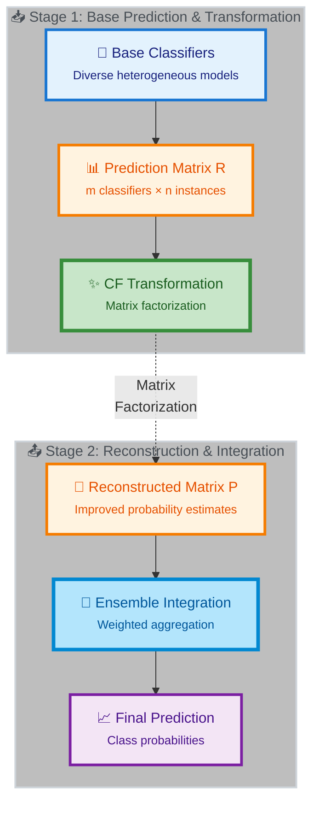

# CF-Ensemble: Meta-learning via Latent-Factor-Based Collaborative Filtering

[](https://opensource.org/licenses/MIT)
[](https://www.python.org/downloads/)
[]()
[](https://github.com/psf/black)

**A breakthrough framework for ensemble classification using collaborative filtering**

---

## 🌟 Overview

Ensemble learning combines multiple base models to improve predictive performance. This project introduces a novel **ensemble transformation stage** using **latent factor-based collaborative filtering (CF)** – an additional layer of meta-learning that transforms base-level predictions before traditional ensemble integration.

### 💡 The Core Idea

We treat ensemble learning as a **collaborative filtering problem**:

```
┌─────────────────────────────────────────────────────────────┐
│                                                             │
│  Recommender Systems         →      Ensemble Learning       │
│  ──────────────────                  ─────────────────      │
│                                                             │
│  👥 Users                    →      🤖 Base Classifiers      │
│  🎬 Items (Movies)           →      📊 Data Points           │
│  ⭐ Ratings (1-5)            →      🎯 Predictions (0-1)     │
│                                                             │
│  Matrix Factorization        →      CF-Ensemble Transform   │
│                                                             │
└─────────────────────────────────────────────────────────────┘
```

### 🎯 Why This Matters

Classification in biomedical domains faces unique challenges:
- ⚖️ **Class imbalance** and skewed distributions
- 🔍 **Missing values** and noisy measurements  
- 🧬 **Complex biological relationships** that vary by problem
- 🎲 **No consensus** on best classifiers (problem-dependent)

**Our Solution**: Transform ensemble predictions using matrix factorization to:
1. ✨ **Increase reliability** of probability estimates
2. 🔬 **Discover patterns** in how classifiers perform
3. 🧭 **Interpret results** through latent factor analysis
4. 🎯 **Identify challenging** instances automatically

---

## 📊 Basic Workflow

### From Base Classifiers to Final Prediction



Or see the original workflow diagram with the probability matrix view:


The process consists of three stages:

1. **🏗️ Ensemble Generation**: Train diverse base classifiers
2. **🔄 Ensemble Transformation** (⭐ *Our Innovation*): Apply CF to transform predictions
3. **🎯 Ensemble Integration**: Combine transformed predictions

---

## 🚀 Quick Start

### Installation

```bash
# Clone repository
git clone https://github.com/pleiadian53/cf-ensemble.git
cd cf-ensemble

# Create environment
mamba env create -f environment.yml
mamba activate cfensemble

# Install package
pip install -e .
```

### Basic Usage

```python
from cfensemble.data import EnsembleData
from cfensemble.optimization import CFEnsembleTrainer

# Your ensemble predictions (m classifiers × n instances)
R = ...  # probability matrix
labels = ...  # ground truth with NaN for unlabeled

# Train CF-Ensemble
ensemble_data = EnsembleData(R, labels)
trainer = CFEnsembleTrainer(latent_dim=10, rho=0.5)
trainer.fit(ensemble_data)

# Get improved predictions
P = trainer.predict(R)  # Reconstructed probabilities
```

---

## 🎯 Features

### ✅ Semi-Supervised Learning
- Leverages unlabeled data to learn classifier reliabilities
- No labels needed for calibration
- Optimal at **5-10% minority class** (validated!)

### ✅ Confidence Weighting
- Multiple strategies (uniform, certainty, label-aware, learned)
- Handles systematic biases and miscalibration
- Interpretable confidence weights

### ✅ Optimized for Imbalanced Data
- **Best performance at 5% minority class** (+3.94% PR-AUC gain)
- PR-AUC as primary metric
- Realistic biomedical scenarios (rare diseases, splice sites)

### ✅ Dual Optimization Backends
- **ALS** (Alternating Least Squares): CPU-friendly, stable
- **PyTorch**: GPU acceleration for large-scale problems

### ✅ Comprehensive Documentation
- Random baseline calculations
- Clinical significance thresholds
- State-of-the-art methods comparison (2026)
- Complete mathematical derivations

---

## 📊 Validated Results (2026-01-24)

### The 5% Sweet Spot Discovery 🏆

| Imbalance | Peak Improvement | Status |
|-----------|------------------|--------|
| **10% positives** | **+1.06%** | ✅ Recommended |
| **5% positives** ⭐ | **+3.94%** 🏆 | ✅✅✅ **OPTIMAL** |
| **1% positives** | **+0.10%** | ❌ Skip |

**Key Finding:** 5% minority class shows BEST gains (non-monotonic relationship!)

**See:** [Complete Results](RESULTS_2026-01-24.md)

---

## 📖 Documentation

### Essential Reading

- **[Imbalanced Data Tutorial](methods/imbalanced_data_tutorial.md)** 🎓 **START HERE**
  - Random baseline calculations
  - Clinical significance thresholds
  - State-of-the-art methods (2026)
  - Where CF-Ensemble fits in

- **[When to Use Confidence Weighting](methods/confidence_weighting/when_to_use_confidence_weighting.md)**
  - Decision trees
  - Evidence-based recommendations
  - Expected gains by scenario

- **[Quick Reference](methods/QUICK_REFERENCE.md)** - One-page cheat sheet

### Deep Dives

- [Confidence Weighting Documentation](methods/confidence_weighting/)
- [Optimization Objective Tutorial](methods/cf_ensemble_optimization_objective_tutorial.md)
- [ALS Mathematical Derivation](methods/als_mathematical_derivation.md)
- [ALS vs PyTorch Comparison](methods/als_vs_pytorch.md)

---

## 💡 Examples

See [Examples](examples_README.md) for complete runnable examples:

### Confidence Weighting
- `quality_threshold_experiment.py` - Validate when confidence weighting helps
- `phase3_confidence_weighting.py` - Compare all strategies
- `reliability_model_demo.py` - Learned reliability weights

### Optimization
- `compare_als_pytorch.py` - Compare ALS vs PyTorch gradient descent

---

## 🤝 Contributing

Contributions welcome! Please open an issue or pull request on GitHub.

---

## 📄 License

MIT License - see [LICENSE](LICENSE) file for details.

---

## 📚 Citation

If you use this code in your research, please cite:

```bibtex
@software{cfensemble2026,
  title={CF-Ensemble: Semi-supervised Ensemble Learning with Confidence Weighting},
  author={CF-Ensemble Research Team},
  year={2026},
  url={https://github.com/pleiadian53/cf-ensemble}
}
```

---

**Documentation site:** https://pleiadian53.github.io/cf-ensemble/
